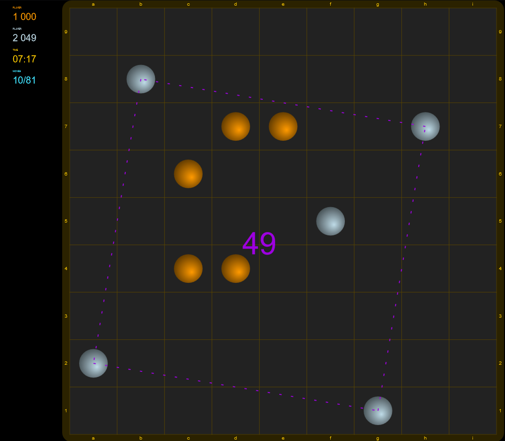

# re-squares
A Meta Squares clone written in ReasonML




## Rules
Two players take turns placing pieces on the board. These pieces can't move once placed. The object of the game is to make squares with these pieces. The larger the square, the more points it's worth. Squares may be tipped at any angle(Ex: a diamond is a valid square). You win when you get over 150 points with at least a 15 point lead over your opponent.

[online play against an AI](https://bitmagie.de/re-squares/)


# Build

The following is used in this project:

+ Node.js 
+ Yarn
+ VSCode with 'reason-vscode' plugin

Further information can be found here : [ReasonML Docs](https://reasonml.github.io/docs/en/editor-plugins)

If you have installed Node and Yarn, initialize the project in the projects root folder with
```
yarn 
```

Install cross-env with
```
npm install -g cross-env
```


## Development workflow

Adjust the ip address off your development machine inside build-utils/webpack.dev.js , then you can call the game under this ip address port 3000.

In the projects root folder:

Compile the code with
```
yarn "bsb:build"
```

Test the code with
```
yarn "test"
```

Remove all compiled files with
```
yarn "bsb:clean"
```

Compile code in watch mode with
```
yarn "bsb:start"
```    

Run DevServer with 
```
yarn "server"
```

## Production workflow

In the projects root folder:

Compile the code with
```
yarn "bsb:build"
```

Pack for distributen with
```
yarn build
```

The code for deployment is under the dist folder.  If you wish to run the code under a subfolder of a webservers documentroot,  you have to adjust the paths accordingly inside the index.html file.# re-squares
